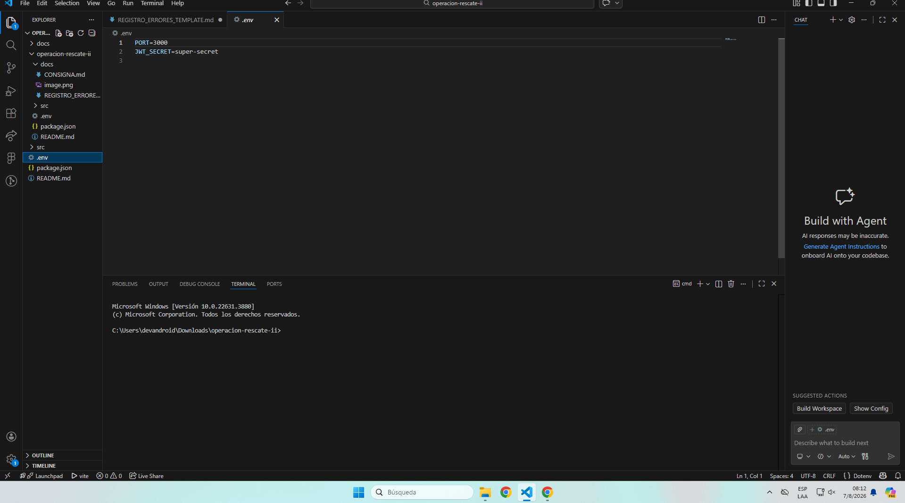
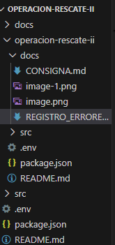
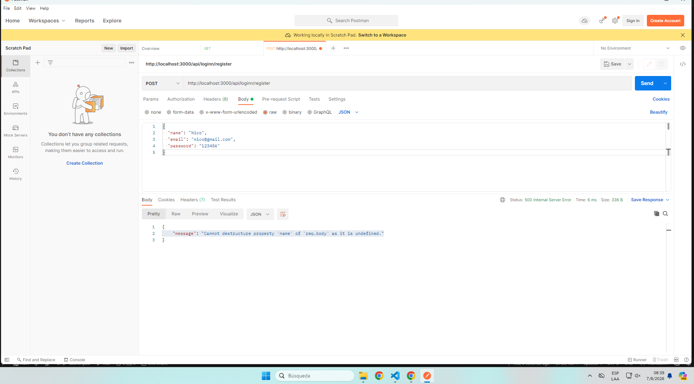
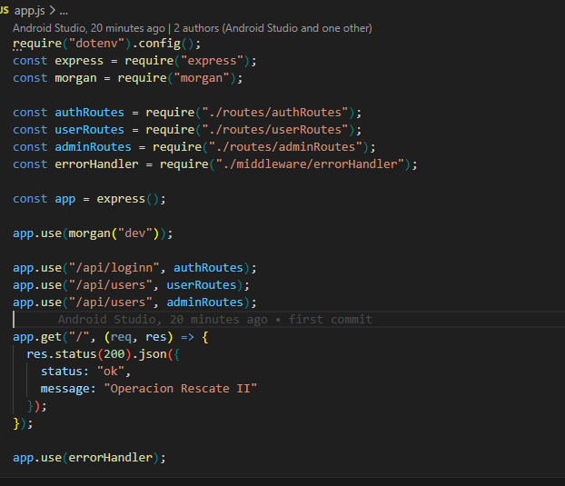
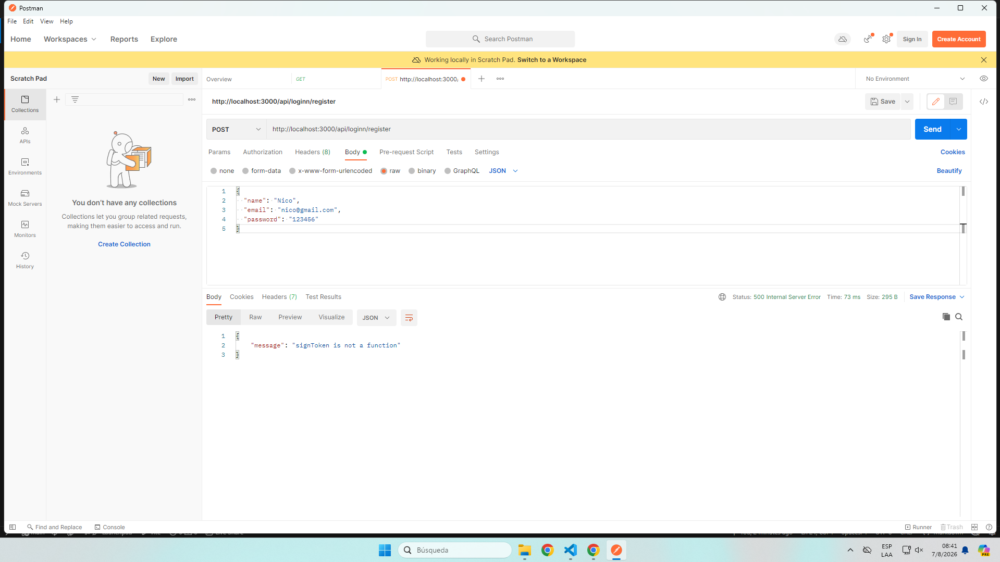
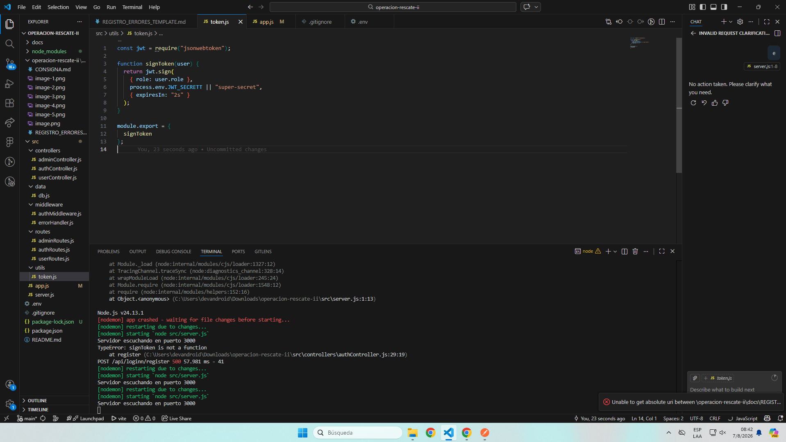
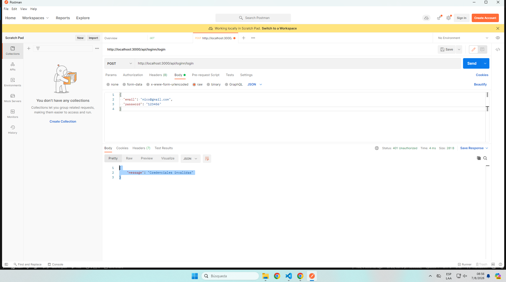
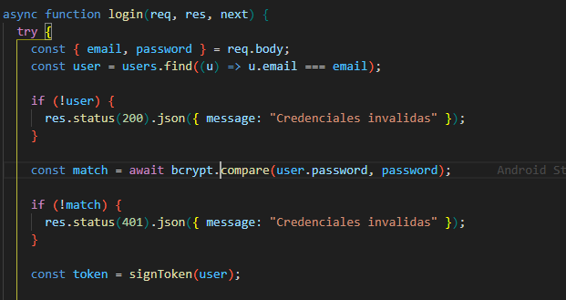
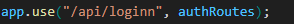

# Registro de Errores

Completar una fila por cada error detectado.

| N | Archivo | Problema encontrado | Como lo detectaron | Solucion aplicada |
|---|---------|---------------------|--------------------|-------------------|
| 1 | src/ejemplo.js | El token no se verificaba | Prueba manual de ruta protegida | Se uso jwt.verify con manejo de excepcion |

## Guia de calidad para el informe

No alcanza con escribir "habia un error y lo arreglamos".

En cada caso expliquen:

1. Que ocurria.
2. Por que ocurria.
3. Como se soluciono.
4. Como validaron que quedo funcionando.

| N |       Archivo          |     Problema encontrado        | Como lo detectaron             |           Solucion aplicada               |
| 1 ||Se ha subido el archivo .env|Lo vimos en los archivos del proyecto|Creamos un gitignore y pusimos el .env allí|
| 2 ||algunos archvios se encuentran duplicados(scr, readme y package.json)|Lo vimos en los archivos del proyecto vimos que fucnionalidades y nombres se repetian|Eliminamos los archvios duplicados.
| 3 ||No se consigue el req.body parseado ya que no se utiliza el middleware de express|Cuando testeamos la ruta de registro en postman aparecio un mensaje que nos advertia de la falla con la recepcion del body|Agregamos el middleware en app.js antes de las rutas
| 4 ||no se exporta correctamente el sign.token|en postman nos advirtio de un error con signtoken. al bsucar la causa del error descubrimos la falla del export|Agregamos una s al export para que funcione el export|
| 5 ||En el inicio sesion a pesar de tener las credenciales validas, se muestra lo contrario, consecuencia de la comparacion de contraseñas en el orden de los parametros ya que primero debe ir la cosntraseña escirta y luego el hash guardado en la base de datos|Fuimos a postman a probar el login, y posteriormente tuvimos un error de creedenciales, al revisar descubrimos ese error|cambiamos el orden de los parametros|
| 6 ||La ruta esta escrita "Mal"(loginn envez de login) lo que podria causar errores al hacer requests|Usando las rutas para las requests nos dimos cuenta del error|Quitamos una n de la loginn|